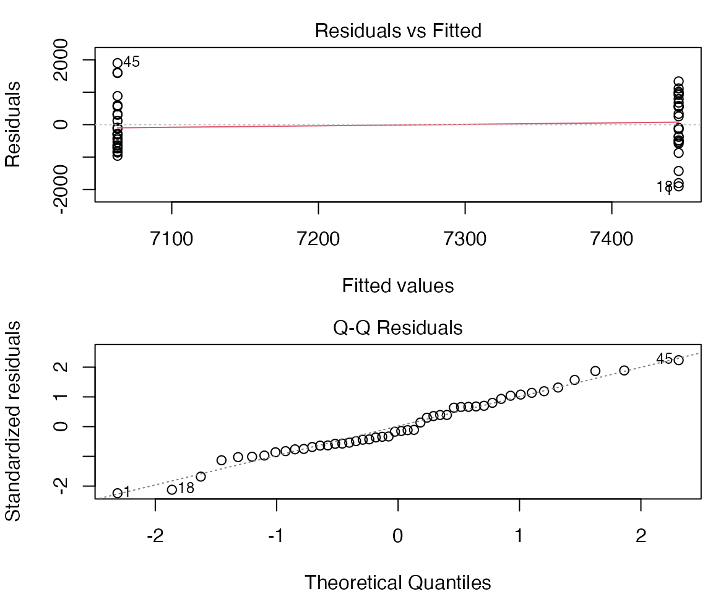
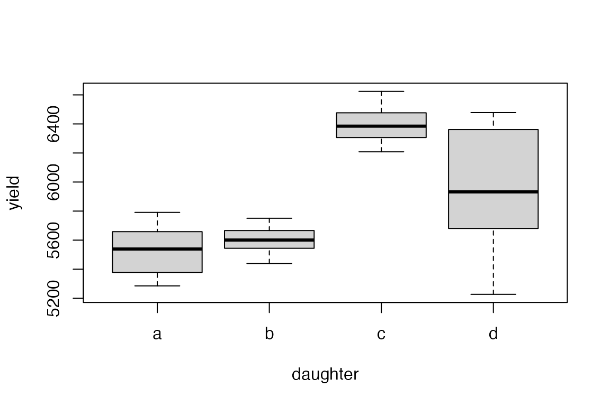

# B. Analysis of Variance

``` r

# Start the mixlm R package
library(mixlm, warn.conflicts = FALSE)
```

## Analysis of Variance (ANOVA)

This vignette will focus on univariate ANOVA in various designs
including fixed and mixed effects, and briefly introduce multivariate
ANOVA. Models using random effects will be run through the mixlm
package.

The following models will be demonstrated: \* Fixed effect models \*
One-way ANOVA \* Two-way ANOVA \* Covariates in ANOVA \* Fixed effect
nested ANOVA \* Linear mixed models \* Classical LMM \* Repeated
measures LMM

### Simulated data

We will start by simulating some data to use in the examples below. In
this fictitious setup, milk yield is measured as a function of feed type
(low/high protein content), cow breed, bull identity, daughter and age.
The three first factors are crossed and balanced, while daughter is
nested under bull.

The yield is generated with a linear model with some noise.

``` r

set.seed(123)
dat <- data.frame(
  feed  = factor(rep(rep(c("low","high"), each=6), 4)),
  breed = factor(rep(c("NRF","Hereford","Angus"), 16)),
  bull  = factor(rep(LETTERS[1:4], each = 12)),
  daughter = factor(c(rep(letters[1:4], 3), rep(letters[5:8], 3), rep(letters[9:12], 3), rep(letters[13:16], 3))),
  age   = round(rnorm(48, mean = 36, sd = 5))
)
dat$yield <- 150*with(dat, 10 + 3 * as.numeric(feed) + as.numeric(breed) + 
                        2 * as.numeric(bull) + 1 * as.numeric(sample(dat$daughter, 48)) + 
                        0.5 * age + rnorm(48, sd = 2))
head(dat)
#>   feed    breed bull daughter age    yield
#> 1  low      NRF    A        a  33 5541.301
#> 2  low Hereford    A        b  35 6862.560
#> 3  low    Angus    A        c  44 6954.182
#> 4  low      NRF    A        d  36 8125.363
#> 5  low Hereford    A        a  37 7344.458
#> 6  low    Angus    A        b  45 7987.227
```

### Fixed effect models

The simplest form of ANOVA is the fixed effect model. This model assumes
that the levels of the factor are fixed and that the only source of
variation is the factor itself.

#### One-way ANOVA

Here we assess only the feed effect on yield, i.e., the following model:
``` math
yield_{an} = \mu + feed_a + \epsilon_{an}
```
where $`a`$ is the feed level and $`n`$ is the observation within the
feed level.

``` r

mod <- lm(yield ~ feed, data = dat)
print(anova(mod))
#> Analysis of Variance Table
#> 
#> Response: yield
#>           Df   Sum Sq Mean Sq F value Pr(>F)
#> feed       1  1755955 1755955  2.3294 0.1338
#> Residuals 46 34675246  753810
```

In the ANOVA table one can look at Pr(\>F) to see if the feed factor has
a significant effect on yield. The summary function can be used to get
more information about the underlying regression model.

``` r

summary(mod)
#> 
#> Call:
#> lm(formula = yield ~ feed, data = dat)
#> 
#> Residuals:
#>     Min      1Q  Median      3Q     Max 
#> -1904.2  -552.8  -135.1   581.1  1898.4 
#> 
#> Coefficients:
#>             Estimate Std. Error t value Pr(>|t|)    
#> (Intercept)   7254.3      125.3  57.887   <2e-16 ***
#> feed(high)    -191.3      125.3  -1.526    0.134    
#> ---
#> Signif. codes:  0 '***' 0.001 '**' 0.01 '*' 0.05 '.' 0.1 ' ' 1
#> 
#> s: 868.2 on 46 degrees of freedom
#> Multiple R-squared: 0.0482,
#> Adjusted R-squared: 0.02751 
#> F-statistic: 2.329 on 1 and 46 DF,  p-value: 0.1338
```

Basic model assessment can be done using the plot function.

``` r

old.par <- par(mfrow=c(2,1), mar=c(4,4,2,0.5))
plot(mod, which = 1:2, ask=FALSE)
```



``` r

par(old.par)
```

#### Two-way crossed effects ANOVA

Here we assess the feed and breed effects and their interaction effect
on yield, i.e., the following model:
``` math
yield_{abn} = \mu + feed_a + breed_b + (feed:breed)_{ab} + \epsilon_{abn}
```
where $`a`$ is the feed level and $`n`$ is the observation within the
feed level.

``` r

mod <- lm(yield ~ feed*breed, data = dat)
print(anova(mod))
#> Analysis of Variance Table
#> 
#> Response: yield
#>            Df   Sum Sq Mean Sq F value Pr(>F)
#> feed        1  1755955 1755955  2.1892 0.1464
#> breed       2   126874   63437  0.0791 0.9241
#> feed:breed  2   860065  430032  0.5361 0.5890
#> Residuals  42 33688307  802103
```

If the interaction effect is not significant, we can simplify the model
to:
``` math
yield_{abn} = \mu + feed_a + breed_b + \epsilon_{abn}
```

``` r

mod <- lm(yield ~ feed+breed, data = dat)
print(anova(mod))
#> Analysis of Variance Table
#> 
#> Response: yield
#>           Df   Sum Sq Mean Sq F value Pr(>F)
#> feed       1  1755955 1755955  2.2363 0.1419
#> breed      2   126874   63437  0.0808 0.9225
#> Residuals 44 34548372  785190
```

#### Types of sums of squares

The classical way of defining sums of squares are Type I, Type II, and
Type III, as described in the documentation of the Anova() function in
the car package.

``` r

# Type I - Sequential testing, including one and one effect
print(anova(mod))
#> Analysis of Variance Table
#> 
#> Response: yield
#>           Df   Sum Sq Mean Sq F value Pr(>F)
#> feed       1  1755955 1755955  2.2363 0.1419
#> breed      2   126874   63437  0.0808 0.9225
#> Residuals 44 34548372  785190

# Type II - Testing each term after all others, 
# except ignoring the term's higher-order relatives
print(Anova(mod, type="II"))
#> Anova Table (Type II tests)
#> 
#> Response: yield
#>             Sum Sq Df F value Pr(>F)
#> feed       1755955  1  2.2363 0.1419
#> breed       126874  2  0.0808 0.9225
#> Residuals 34548372 44

# Type III - Testing each term after all others,
# including the term's higher-order relatives
print(Anova(mod, type="III"))
#> Anova Table (Type III tests)
#> 
#> Response: yield
#>                 Sum Sq Df   F value Pr(>F)    
#> (Intercept) 2525982362  1 3217.0322 <2e-16 ***
#> feed           1755955  1    2.2363 0.1419    
#> breed           126874  2    0.0808 0.9225    
#> Residuals     34548372 44                     
#> ---
#> Signif. codes:  0 '***' 0.001 '**' 0.01 '*' 0.05 '.' 0.1 ' ' 1
```

For the two-way ANOVA model, the Type I and Type II sums of squares are
the same, while Type III differs. With balanced data, this only happens
when the contrast coding is of the treatment/reference type.

#### Contrast codings

The contrast coding can be specified for each factor in the model. The
default is reference coding, but other codings can be specified using
the `contrasts` Since we are running lm() through the mixlm package, we
can use the `contrasts` argument to specify the coding for all effects
simultaneously.

``` r

# Sum-coding, i.e., the sum of all levels is zero and all effects
# are orthogonal in the balanced case.
mod <- lm(yield ~ feed*breed, data = dat, contrasts="contr.sum")
print(Anova(mod, type="III"))
#> Anova Table (Type III tests)
#> 
#> Response: yield
#>                 Sum Sq Df   F value Pr(>F)    
#> (Intercept) 2525982362  1 3149.2013 <2e-16 ***
#> feed           1755955  1    2.1892 0.1464    
#> breed           126874  2    0.0791 0.9241    
#> feed:breed      860065  2    0.5361 0.5890    
#> Residuals     33688307 42                     
#> ---
#> Signif. codes:  0 '***' 0.001 '**' 0.01 '*' 0.05 '.' 0.1 ' ' 1

# Weighted coding, i.e., the sum of all levels is zero and the effects
# are weighted by the number of levels, effect-wise.
mod <- lm(yield ~ feed*breed, data = dat, contrasts="contr.weighted")
print(Anova(mod, type="III"))
#> Anova Table (Type III tests)
#> 
#> Response: yield
#>                 Sum Sq Df   F value Pr(>F)    
#> (Intercept) 2525982362  1 3149.2013 <2e-16 ***
#> feed           1755955  1    2.1892 0.1464    
#> breed           126874  2    0.0791 0.9241    
#> feed:breed      860065  2    0.5361 0.5890    
#> Residuals     33688307 42                     
#> ---
#> Signif. codes:  0 '***' 0.001 '**' 0.01 '*' 0.05 '.' 0.1 ' ' 1
```

Instead of specifying the contrasts in a specific model, it is also
possible to set the contrasts globally for the session. This means that
all subsequent models, unless specified otherwise, will use the
specified contrasts.

``` r

options(contrasts = c("contr.sum", "contr.poly"))
```

#### Covariates in ANOVA

Adding covariates to an ANOVA model is straightforward. Here we add the
age of the cow as a covariate to the two-way ANOVA model. The model
becomes:
``` math
yield_{abn} = \mu + feed_a + breed_b + (feed:breed)_{ab} + age\cdot x_{abn} + \epsilon_{abn},
```
where $`x_{abn}`$ is the age of the cow and $`age`$ is its linear
coefficient.

``` r

mod <- lm(yield ~ feed*breed + age, data = dat)
print(Anova(mod, type="II"))
#> Anova Table (Type II tests)
#> 
#> Response: yield
#>              Sum Sq Df F value    Pr(>F)    
#> feed        1718601  1  2.9288 0.0945692 .  
#> breed         13015  2  0.0111 0.9889747    
#> age         9629682  1 16.4106 0.0002214 ***
#> feed:breed   793690  2  0.6763 0.5140804    
#> Residuals  24058625 41                      
#> ---
#> Signif. codes:  0 '***' 0.001 '**' 0.01 '*' 0.05 '.' 0.1 ' ' 1
```

#### Fixed effect nested ANOVA

In the case of nested factors, we can specify this in the model. In the
current model, we assume that bulls are fixed effects that we are
interested in and that daughters are nested under bulls. In this case,
the daughters do not have any special attributes that would interfere
with the estimation of the bull effect, so we do not have to assume that
they are random effects. The model becomes:
``` math
yield_{abn} = \mu + bull_a + daugter_{b(a)} + \epsilon_{abn},
```

``` r

mod <- lm(yield ~ bull + daughter%in%bull, data = dat)
print(Anova(mod, type="II"))
#> Note: model has aliased coefficients
#>       sums of squares computed by model comparison
#> Anova Table (Type II tests)
#> 
#> Response: yield
#>                 Sum Sq Df F value Pr(>F)
#> bull           2130879  3  0.8630 0.4703
#> bull:daughter  7961749 12  0.8061 0.6421
#> Residuals     26338573 32
```

### Linear mixed models

Adding random effects to a model can be done either using least squares
modelling through the mixlm package or using ML/REML estimation through
the lme4 package (or similar).

#### Classical - mixlm

Using the mixlm package, we specify the random effects using the `r()`
function. If we assume that the bull is a random selection from the
population of bulls, we can specify this as a random effect when
focusing on feed. The model looks like a fixed effect model, but the
error structure is different:
``` math
yield_{abn} = \mu + feed_a + bull_b + (feed:bull)_{ab} + \epsilon_{abn}
```

``` r

mod <- lm(yield ~ feed*r(bull), data = dat)
print(Anova(mod, type="II"))
#> Analysis of variance (unrestricted model)
#> Response: yield
#>              Mean Sq      Sum Sq Df F value Pr(>F)
#> feed      1755954.98  1755954.98  1    8.20 0.0644
#> bull       710292.91  2130878.72  3    3.32 0.1755
#> feed:bull  214160.94   642482.83  3    0.27 0.8477
#> Residuals  797547.10 31901884.17 40       -      -
#> 
#>             Err.term(s) Err.df VC(SS)
#> 1 feed              (3)      3  fixed
#> 2 bull              (3)      3  41344
#> 3 feed:bull         (4)     40 -97231
#> 4 Residuals           -      - 797547
#> (VC = variance component)
#> 
#>           Expected mean squares
#> feed      (4) + 6 (3) + 24 Q[1]
#> bull      (4) + 6 (3) + 12 (2) 
#> feed:bull (4) + 6 (3)          
#> Residuals (4)
```

In addition to the ordinary ANOVA table, an overview of variance
components and expected mean squares are printed.

#### Restrictions

The mixlm package has unrestricted models as default, but it is possible
to turn on restriction.

``` r

mod <- lm(yield ~ feed*r(bull), data = dat, unrestricted = FALSE)
print(Anova(mod, type="II"))
#> Analysis of variance (restricted model)
#> Response: yield
#>              Mean Sq      Sum Sq Df F value Pr(>F)
#> feed      1755954.98  1755954.98  1    8.20 0.0644
#> bull       710292.91  2130878.72  3    0.89 0.4543
#> feed:bull  214160.94   642482.83  3    0.27 0.8477
#> Residuals  797547.10 31901884.17 40       -      -
#> 
#>             Err.term(s) Err.df VC(SS)
#> 1 feed              (3)      3  fixed
#> 2 bull              (4)     40  -7271
#> 3 feed:bull         (4)     40 -97231
#> 4 Residuals           -      - 797547
#> (VC = variance component)
#> 
#>           Expected mean squares
#> feed      (4) + 6 (3) + 24 Q[1]
#> bull      (4) + 12 (2)         
#> feed:bull (4) + 6 (3)          
#> Residuals (4)
```

This effects which tests are performed and how the variance components
are estimated.

#### Repeated Measures

A repeated measures model can be a mixed model with a random effect for
the repeated measures, where the repeated measures are nested under the
subjects. Longitudinal data is a common example of repeated measures
data, where the replicates are repetitions over time within subject. If
we subset the simulated data, we can add a longitudinal effect to the
model, in this case a random variation over three time-points. The time
effect does not necessarily need to be random.

``` r

set.seed(123)
long <- dat[c(1:4,9:12), c("feed", "daughter", "yield")]
long <- rbind(long, long, long)
long$daughter <- factor(long$daughter) # Remove redundant daughter
long$time  <- factor(rep(1:3, each=8))
long$yield <- long$yield + rnorm(24, sd = 100) + rep(c(-200,0,200), each=8)
plot(yield~daughter, data=long)
```



Now we have a feed effect, individuals (daughters), and a time effect
repeated inside daughters, with the model:
``` math
yield_{ait} = \mu + daughter_i + feed_a + time_t + (feed:time)_{at} + \epsilon_{ait}
```

``` r

mod <- lm(yield ~ r(daughter) + feed*r(time), data = long, unrestricted=FALSE)
print(Anova(mod, type="II"))
#> Analysis of variance (restricted model)
#> Response: yield
#>              Mean Sq     Sum Sq Df F value Pr(>F)
#> daughter  1085642.42 3256927.25  3   1.854 0.1808
#> feed        21759.92   21759.92  1   7.079 0.1170
#> time       213465.79  426931.58  2   0.365 0.7005
#> feed:time    3073.71    6147.41  2   0.005 0.9948
#> Residuals  585554.07 8783311.09 15       -      -
#> 
#>             Err.term(s) Err.df  VC(SS)
#> 1 daughter          (5)     15   83348
#> 2 feed              (4)      2   fixed
#> 3 time              (5)     15  -46511
#> 4 feed:time         (5)     15 -145620
#> 5 Residuals           -      -  585554
#> (VC = variance component)
#> 
#>           Expected mean squares
#> daughter  (5) + 6 (1)          
#> feed      (5) + 4 (4) + 12 Q[2]
#> time      (5) + 8 (3)          
#> feed:time (5) + 4 (4)          
#> Residuals (5)
```

#### REML

REML estimation can be done directly with the lme4 package, but we can
also do this through the mixlm package, leveraging the r() function.

``` r

mod <- lm(yield ~ feed*r(bull), data = dat, REML = TRUE)
#> boundary (singular) fit: see help('isSingular')
print(Anova(mod, type="III"))
#> Analysis of Deviance Table (Type III Wald chisquare tests)
#> 
#> Response: yield
#>                 Chisq Df Pr(>Chisq)    
#> (Intercept) 3350.9550  1     <2e-16 ***
#> feed           2.3294  1     0.1269    
#> ---
#> Signif. codes:  0 '***' 0.001 '**' 0.01 '*' 0.05 '.' 0.1 ' ' 1
```

To see how mixlm transforms the model to lme4, we can print the model.

``` r

print(mod)
#> Linear mixed model fit by REML ['lmerMod']
#> Formula: yield ~ feed + (1 | bull) + (1 | feed:bull)
#>    Data: dat
#> REML criterion at convergence: 760.7979
#> Random effects:
#>  Groups    Name        Std.Dev.
#>  feed:bull (Intercept)   0.0   
#>  bull      (Intercept)   0.0   
#>  Residual              868.2   
#> Number of obs: 48, groups:  feed:bull, 8; bull, 4
#> Fixed Effects:
#> (Intercept)        feed1  
#>      7254.3       -191.3  
#> optimizer (nloptwrap) convergence code: 0 (OK) ; 0 optimizer warnings; 1 lme4 warnings
```

We observe that (1 \| bull) and (1 \| <feed:bull>) are added to the
model, which means that random intercepts are added for both bull and
the interaction.

### Multivariate ANOVA (MANOVA)

Basic multivariate ANOVA can be done using the lm() function, if we
create a matrix of responses. In this case, we add a mastitis effect to
the model.

``` r

dat$mastitis <- as.numeric(dat$breed) + as.numeric(dat$feed) + rnorm(48, sd = 1)
```

The model becomes:
``` math
[yield_{abn} | mastitis_{abn}] = \mu + feed_a + breed_b + (feed:breed)_{ab} + \epsilon_{abn},
```
where each of the model terms now are vectors matching the number of
responses.

``` r

mod <- lm(cbind(yield,mastitis) ~ feed*breed, data = dat)
print(Anova(mod, type="II"))
#> 
#> Type II MANOVA Tests: Pillai test statistic
#>            Df test stat approx F num Df den Df   Pr(>F)    
#> feed        1   0.16426   4.0292      2     41 0.025260 *  
#> breed       2   0.47415   6.5256      4     84 0.000127 ***
#> feed:breed  2   0.14929   1.6939      4     84 0.159025    
#> ---
#> Signif. codes:  0 '***' 0.001 '**' 0.01 '*' 0.05 '.' 0.1 ' ' 1
```

The test statistics are joint for all responses, here in the form of the
default Pillai’s test statistics. Other statistics can be produced as
follows:

``` r

print(Anova(mod, type="II", test="Wilks"))
#> 
#> Type II MANOVA Tests: Wilks test statistic
#>            Df test stat approx F num Df den Df   Pr(>F)    
#> feed        1   0.83574   4.0292      2     41  0.02526 *  
#> breed       2   0.52761   7.7226      4     82 2.48e-05 ***
#> feed:breed  2   0.85375   1.6865      4     82  0.16100    
#> ---
#> Signif. codes:  0 '***' 0.001 '**' 0.01 '*' 0.05 '.' 0.1 ' ' 1
print(Anova(mod, type="II", test="Hotelling-Lawley"))
#> 
#> Type II MANOVA Tests: Hotelling-Lawley test statistic
#>            Df test stat approx F num Df den Df    Pr(>F)    
#> feed        1   0.19655   4.0292      2     41   0.02526 *  
#> breed       2   0.89201   8.9201      4     80 5.227e-06 ***
#> feed:breed  2   0.16775   1.6775      4     80   0.16336    
#> ---
#> Signif. codes:  0 '***' 0.001 '**' 0.01 '*' 0.05 '.' 0.1 ' ' 1
print(Anova(mod, type="II", test="Roy"))
#> 
#> Type II MANOVA Tests: Roy test statistic
#>            Df test stat approx F num Df den Df    Pr(>F)    
#> feed        1   0.19655   4.0292      2     41   0.02526 *  
#> breed       2   0.88826  18.6535      2     42 1.595e-06 ***
#> feed:breed  2   0.14285   2.9999      2     42   0.06056 .  
#> ---
#> Signif. codes:  0 '***' 0.001 '**' 0.01 '*' 0.05 '.' 0.1 ' ' 1
```

The summary function can be used to get more information about the
underlying regression model, here revealing the regressions are
performed separately for each response.

``` r

summary(mod)
#> 
#> Call:
#> lm(formula = cbind(yield, mastitis) ~ feed * breed, data = dat)
#> 
#> Residuals:
#>          yield mastitis
#> Min    -2123.5 -2.25984
#> 1Q      -506.2 -0.60241
#> Median  -109.0  0.07629
#> 3Q       625.8  0.60307
#> Max     1762.0  1.82843
#> 
#> Coefficients:
#>      Estimate Std. Error t value Pr(>|t|)    
#> [1,]  7254.28     129.27  56.118   <2e-16 ***
#> [2,]  -191.27     129.27  -1.480    0.146    
#> [3,]    40.78     182.81   0.223    0.825    
#> [4,]   -72.52     182.81  -0.397    0.694    
#> [5,]   116.25     182.81   0.636    0.528    
#> [6,]    71.26     182.81   0.390    0.699    
#> ---
#> Signif. codes:  0 '***' 0.001 '**' 0.01 '*' 0.05 '.' 0.1 ' ' 1
#> 
#> s: 895.6 on 42 degrees of freedom
#> Multiple R-squared: 0.974,
#> Adjusted R-squared: 0.971 
#> F-statistic: 315.3 on 5 and 42 DF,  p-value: < 2.2e-16
```
