# C. ASCA

``` r

# Start the HDANOVA R package
library(HDANOVA)
#> 
#> Attaching package: 'HDANOVA'
#> The following object is masked from 'package:stats':
#> 
#>     loadings
```

## Analysis of Variance Simultaneous Component Analysis (ASCA)

The ANOVA part of ASCA includes all the possible variations of ANOVA
demonstrated in the ANOVA section and more. Also, generalized linear
models (GLM) can be used. The following theory will be exemplified:

- Basic ASCA
  - Permutation testing
  - Random effects
  - Scores and loadings
  - Data and confidence ellipsoids
  - Combined effects
  - Numeric effects
- ANOVA-PCA (APCA)
- PC-ANOVA
- MSCA
- LiMM-PCA

### HDANOVA

The ANOVA part of ASCA includes all the possible variations of ANOVA
demonstrated in the ANOVA vignette and more. Also generalized linear
models (GLM) can be used. We start by demonstrating HDANOVA with a fixed
effect model of two factors with interactions.

``` r

# Load Candy data
data(candies)

# Fit ASCA model
mod <- hdanova(assessment ~ candy*assessor, data=candies)
summary(mod)
#> High-Dimensional Analysis of Variance fitted using 'lm' (Linear Model) 
#> - SS type II, sum coding, restricted model, least squares estimation, SSQ method: qr_regression 
#>                 Sum.Sq. Expl.var.(%)
#> candy          33416.66        74.48
#> assessor        1961.37         4.37
#> candy:assessor  3445.73         7.68
#> Residuals       6043.52        13.47
```

The summary shows that the candy effect is the largest by far.

### Basic ASCA

If we use the ASCA function directly, we get the same result as with
HDANOVA, but in addition PCAs on the effect matrices are computed.

``` r

# Fit ASCA model
mod <- asca(assessment ~ candy*assessor, data=candies)
summary(mod)
#> Anova Simultaneous Component Analysis fitted using 'lm' (Linear Model) 
#> - SS type II, sum coding, restricted model, least squares estimation, SSQ method: qr_regression 
#>                 Sum.Sq. Expl.var.(%)
#> candy          33416.66        74.48
#> assessor        1961.37         4.37
#> candy:assessor  3445.73         7.68
#> Residuals       6043.52        13.47
```

This can also be done sequentially, expanding the model step by step.

``` r

# Fit ASCA model step by step
mod_hd <- hdanova(assessment ~ candy*assessor, data=candies)
mod_asca <- sca(mod_hd)
```

#### Permutation testing

To get more insight, we can perform permutation testing of the factors.
Here we use approximate permutation.

``` r

# Permutation testing (default = 1000 permutations, if not specified)
mod <- asca(assessment ~ candy*assessor, data=candies, permute=TRUE)
summary(mod)
#> Anova Simultaneous Component Analysis fitted using 'lm' (Linear Model) 
#> - SS type II, sum coding, restricted model, least squares estimation, SSQ method: qr_regression, 1000 permutations 
#>                 Sum.Sq. Expl.var.(%) p-value
#> candy          33416.66        74.48       0
#> assessor        1961.37         4.37       0
#> candy:assessor  3445.73         7.68       0
#> Residuals       6043.52        13.47      NA
```

Here we see that all effects are significant, where the Candy effect is
the dominating one. (The P-values are rounded from 0.001 to 0 in the
print). This can also be visualised by looking at the sums-of-squares
values obtained under permutation compared to the original value.

``` r

permutationplot(mod, factor = "assessor")
```

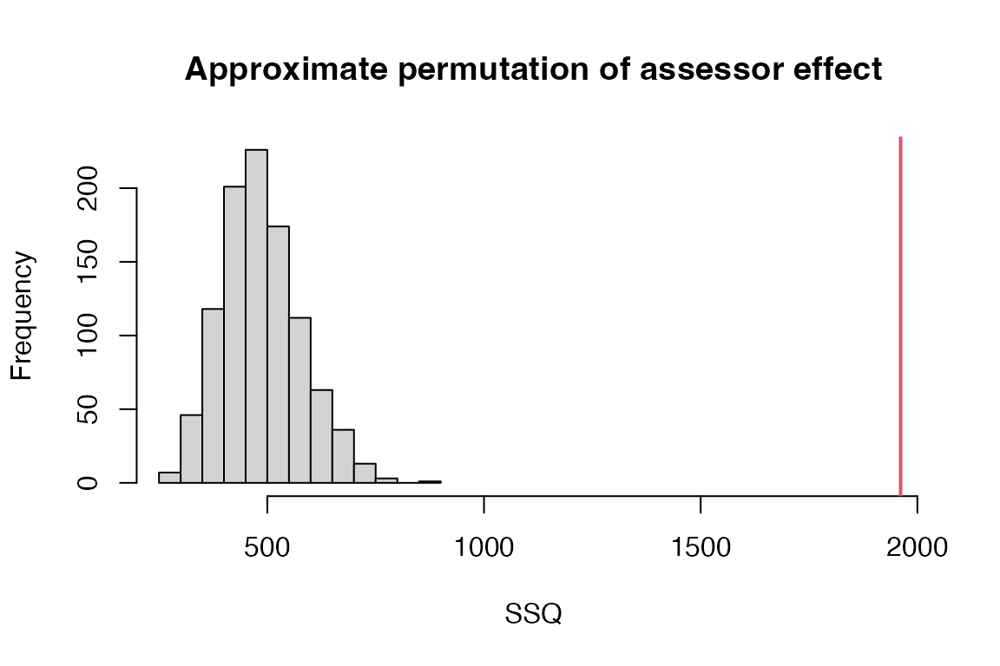

Permutations can also be performed as a post processing of an ASCA
object.

``` r

mod <- asca(assessment ~ candy*assessor, data=candies)
mod <- permutation(mod)
```

#### Random effects

One can argue that the assessors are random effects, thus should be
handled as such in the model. We can do this by adding r() around the
assessor term. See also LiMM-PCA below for the REML estimation version.

``` r

# Fit ASCA model with random assessor
mod.mixed <- asca(assessment ~ candy*r(assessor), data=candies, permute=TRUE)
summary(mod.mixed)
#> Anova Simultaneous Component Analysis fitted using 'lmm' (Linear Mixed Model) 
#> - SS type II, sum coding, restricted model, least squares estimation, SSQ method: qr_regression, 1000 permutations 
#>                 Sum.Sq. Expl.var.(%) p-value
#> candy          33416.66        74.48       0
#> assessor        1961.37         4.37       0
#> candy:assessor  3445.73         7.68       0
#> Residuals       6043.52        13.47      NA
```

#### Scores and loadings

The effects can be visualised through, e.g., loading and score plots to
assess the relations between variables, objects and factors. If a factor
is not specified, the first factor is plotted.

``` r

par.old <- par(mfrow=c(2,1), mar=c(4,4,2,1))
loadingplot(mod, scatter=TRUE, labels="names", main="Candy loadings")
scoreplot(mod, main="Candy scores")
```

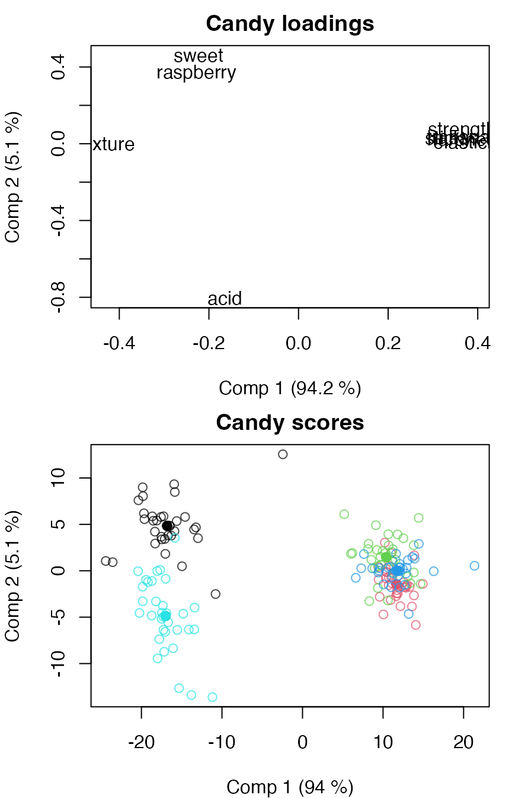

``` r

par(par.old)
```

A specific factor can be plotted by specifying the factor name or
number.

``` r

par.old <- par(mfrow=c(2,1), mar=c(4,4,2,1))
loadingplot(mod, factor="assessor", scatter=TRUE, labels="names", main="Assessor loadings")
scoreplot(mod, factor="assessor", main="Assessor scores")
```

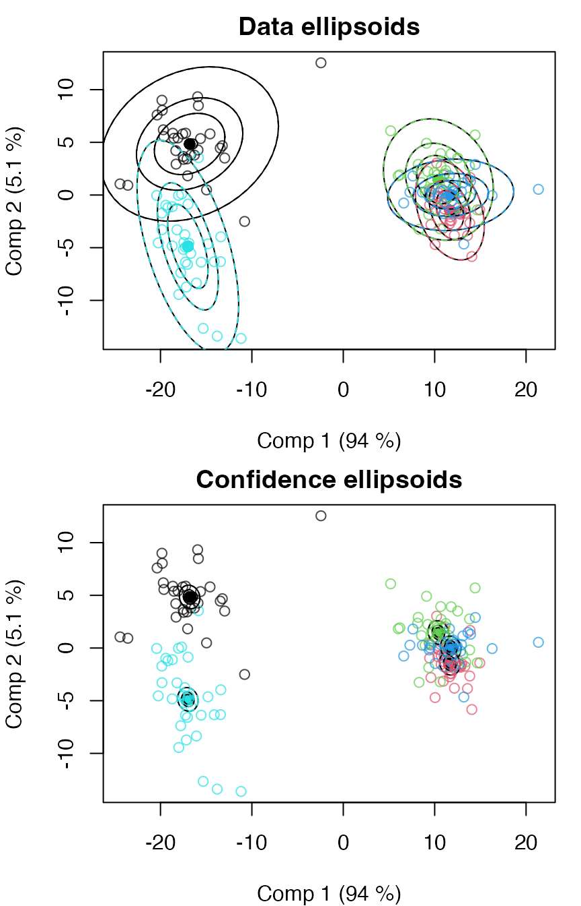

``` r

par(par.old)
```

Score plots can be modified, e.g., omitting backprojections or adding
spider plots.

``` r

par.old <- par(mfrow=c(2,1), mar=c(4,4,2,1))
scoreplot(mod, factor="assessor", main="Assessor scores", projections=FALSE)
scoreplot(mod, factor="assessor", main="Assessor scores", spider=TRUE)
```

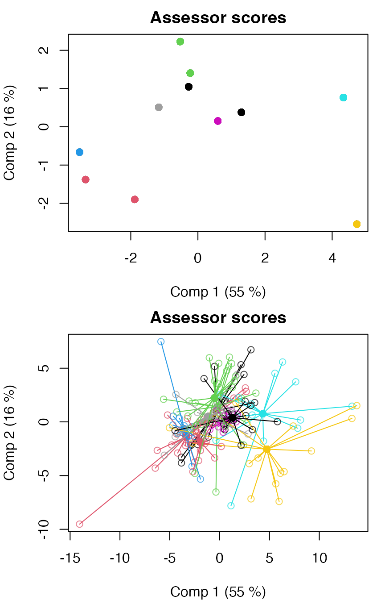

``` r

par(par.old)
```

If the directions of the scores or loadings are not as expected, the
signs can be flipped.

``` r

mod <- signflip(mod, factor="candy", comp=1)
par.old <- par(mfrow=c(2,1), mar=c(4,4,2,1))
loadingplot(mod, scatter=TRUE, labels="names", main="Candy loadings")
scoreplot(mod, main="Candy scores")
```

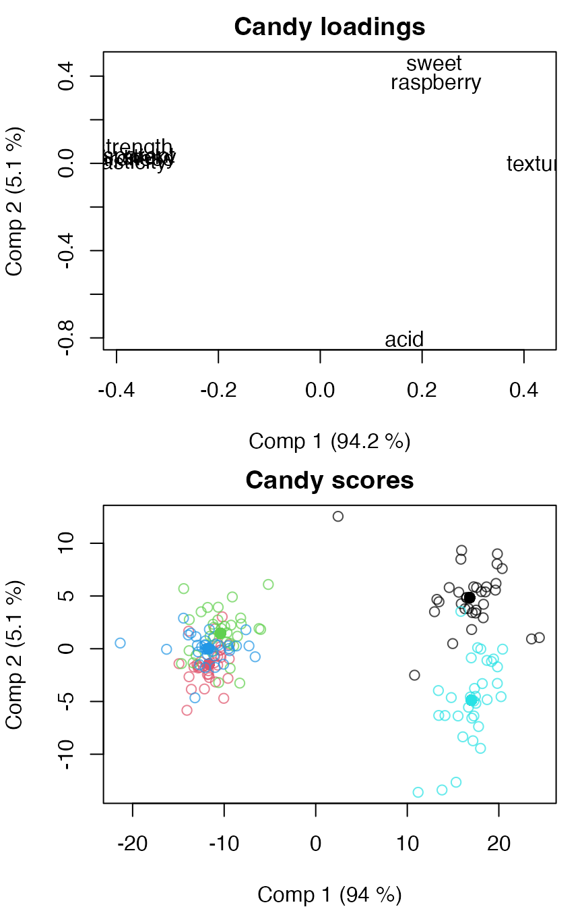

``` r

par(par.old)
```

And scores and loadings can be extracted for further analysis.

``` r

L <- loadings(mod, factor="candy")
head(L)
#>                 Comp 1        Comp 2      Comp 3      Comp 4
#> transparent -0.3927649  0.0279168248 -0.30598369  0.77398098
#> acid         0.1649285 -0.8042012208  0.47650301  0.24192158
#> sweet        0.2235032  0.4607791525  0.52330000 -0.01751194
#> raspberry    0.2277610  0.3663430297  0.35862959  0.50808527
#> texture      0.4302019 -0.0004154248 -0.13000106  0.22107937
#> strength    -0.3653312  0.0694885591  0.09828578 -0.09582978
S <- scores(mod, factor="candy")
head(S)
#>     Comp 1   Comp 2     Comp 3    Comp 4
#> 1 16.81343 4.844756 -0.2914198 0.1811588
#> 2 16.81343 4.844756 -0.2914198 0.1811588
#> 3 16.81343 4.844756 -0.2914198 0.1811588
#> 4 16.81343 4.844756 -0.2914198 0.1811588
#> 5 16.81343 4.844756 -0.2914198 0.1811588
#> 6 16.81343 4.844756 -0.2914198 0.1811588
```

Finally, scores and loadings can be combined into a biplot.

``` r

biplot(mod, factor="candy", labels="names")
```

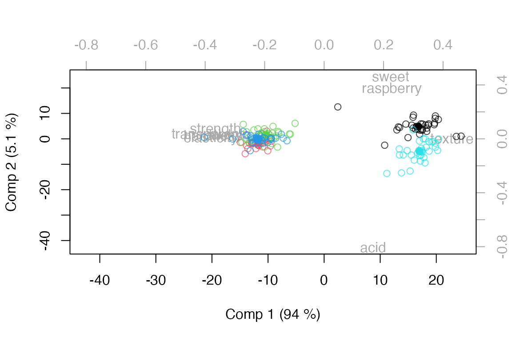

#### Data ellipsoids and confidence ellipsoids

To emphasize factor levels or assess factor level differences, we can
add data ellipsoids or confidence ellipsoids to the score plot. The
confidence ellipsoids are built on the assumption of balanced data, and
their theories are built around crossed designs.

``` r

par.old <- par(mfrow=c(2,1), mar=c(4,4,2,1))
scoreplot(mod, ellipsoids="data", factor="candy", main="Data ellipsoids")
scoreplot(mod, ellipsoids="confidence", factor="candy", main="Confidence ellipsoids")
```

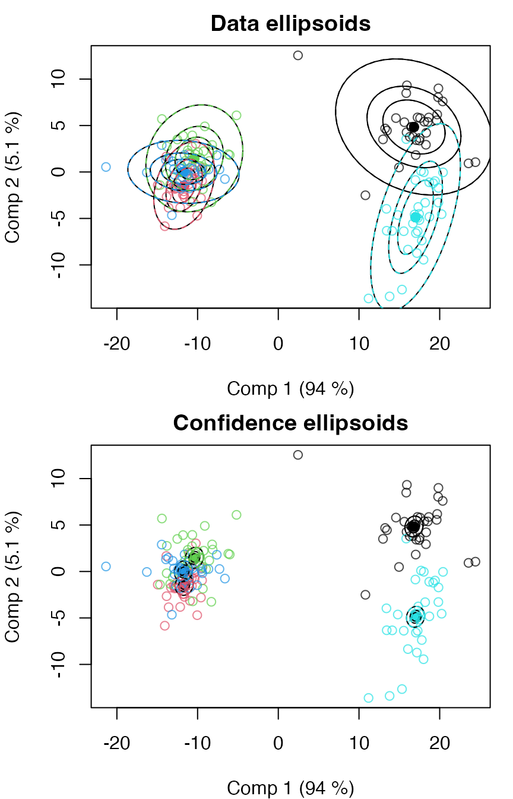

``` r

par(par.old)
```

If we repeat this for the mixed model, we see that both types of
ellipsoids change together with the change in denominator term in the
underlying ANOVA model. It should be noted that the theory for
confidence ellipsoids in mixed models is not fully developed, so
interpretation should be done with caution.

``` r

par.old <- par(mfrow=c(2,1), mar=c(4,4,2,1))
scoreplot(mod.mixed, ellipsoids="data", factor="candy", main="Data ellipsoids")
scoreplot(mod.mixed, ellipsoids="confidence", factor="candy", main="Confidence ellipsoids")
```

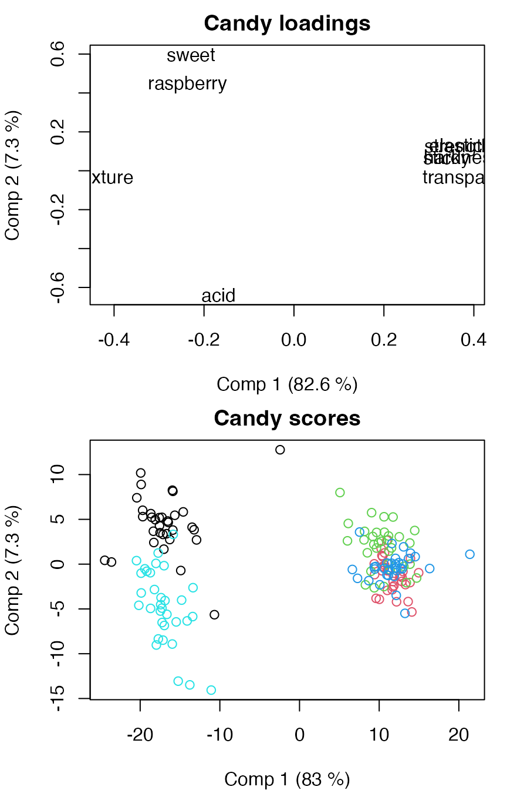

``` r

par(par.old)
```

#### Combined effects

In some cases, it can be of interest to combine effects in ASCA. Here,
we use an example with the Caldana data where we combine the *light*
effect with the *time:light* interaction using the *comb()* function.

``` r

# Load Caldana data
data(caldana)

# Combined effects
mod.comb <- asca(compounds ~ time + comb(light + time:light), data=caldana)
summary(mod.comb)
#> Anova Simultaneous Component Analysis fitted using 'lm' (Linear Model) 
#> - SS type II, sum coding, restricted model, least squares estimation, SSQ method: qr_regression 
#>                  Sum.Sq. Expl.var.(%)
#> time              154.58         9.69
#> light+time:light  349.64        21.92
#> Residuals        1091.14        68.39
```

When combined effects have a time factor, the scores can be plotted
against time.

``` r

# Scores plotted as a function of time
par.old <- par(mfrow=c(2,1), mar = c(4,4,1,1))
timeplot(mod.comb, factor="light", time="time", comb=2, comp=1, x_time=TRUE)
timeplot(mod.comb, factor="light", time="time", comb=2, comp=2, x_time=TRUE)
```

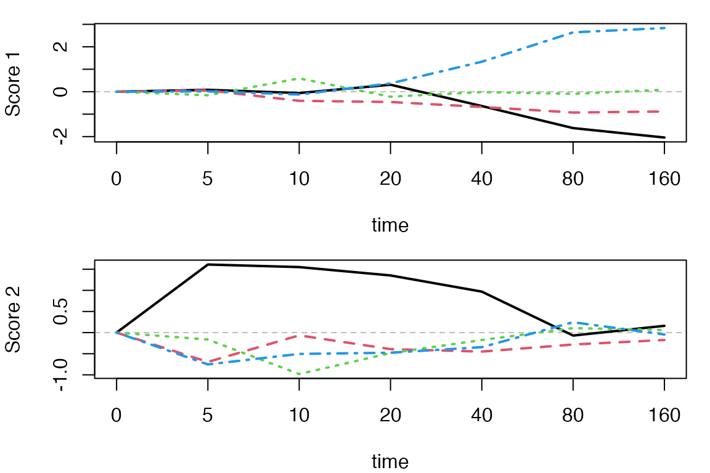

``` r

par(par.old)
```

#### Quantitative effects

Quantitative effects, so-called covariates, can also be included in a
model, though their use in ASCA are limited to ANOVA estimation and
explained variance, not being used in subsequent PCA or permutation
testing. We demonstrate this using the Caldana data again, but now
recode the time effect to a quantitative effect, meaning it will be
handled as a linear continuous effect.

``` r

caldanaNum <- caldana
caldanaNum$time <- as.numeric(as.character(caldanaNum$time))
mod.num <- asca(compounds ~ time*light, data = caldanaNum)
summary(mod.num)
#> Anova Simultaneous Component Analysis fitted using 'lm' (Linear Model) 
#> - SS type II, sum coding, restricted model, least squares estimation, SSQ method: qr_regression 
#>            Sum.Sq. Expl.var.(%)
#> time         55.42         3.47
#> light       102.49         6.42
#> time:light  109.56         6.87
#> Residuals  1327.90        83.23
```

### ANOVA-PCA (APCA)

APCA differs from ASCA by adding the error term to the model before
performing PCA instead of backprojecting errors afterwards.

``` r

# Fit APCA model
modp <- apca(assessment ~ candy*assessor, data=candies)
summary(modp)
#> Anova Principal Component Analysis fitted using 'lm' (Linear Model) 
#> - SS type II, sum coding, restricted model, least squares estimation, SSQ method: qr_regression 
#>                 Sum.Sq. Expl.var.(%)
#> candy          33416.66        74.48
#> assessor        1961.37         4.37
#> candy:assessor  3445.73         7.68
#> Residuals       6043.52        13.47
```

Plot scores and loadings.

``` r

par.old <- par(mfrow=c(2,1), mar=c(4,4,2,1))
loadingplot(modp, scatter=TRUE, labels="names", main="Candy loadings")
scoreplot(modp, main="Candy scores")
```

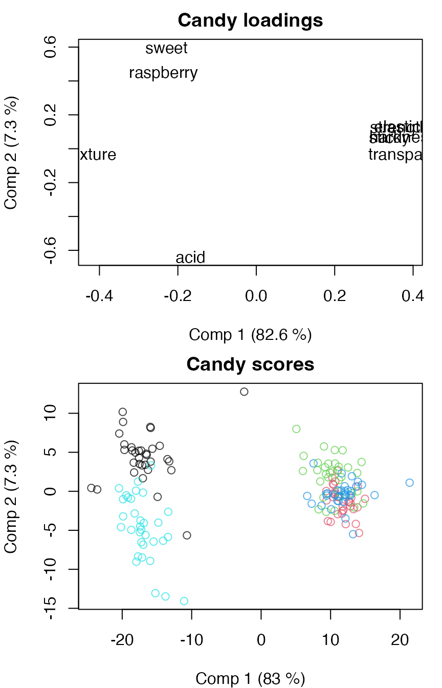

``` r

par(par.old)
```

### PC-ANOVA

In PC-ANOVA, a PCA is first applied to the data before the scores are
subjected to ANOVA, effectively reversing the roles in ASCA. This means
there will be one or more ANOVA tables in the summary of the output. In
this example, we have chosen to use the number of components that
explain at least 90% of the variation of the data.

``` r

mod.pc <- pcanova(assessment ~ candy * assessor, data = candies, ncomp = 0.9)
print(mod.pc)
#> PC-ANOVA - Principal Components Analysis of Variance
#> 
#> Call:
#> pcanova(formula = assessment ~ candy * assessor, data = candies,     ncomp = 0.9)
summary(mod.pc)
#> PC-ANOVA - Principal Components Analysis of Variance
#> 
#> Call:
#> pcanova(formula = assessment ~ candy * assessor, data = candies,     ncomp = 0.9)
#> $`Comp. 1`
#>                 Df     Sum Sq    Mean Sq    F value       Pr(>F) Error Term
#> candy            4 31470.6052 7867.65131 780.176157 9.969318e-80  Residuals
#> assessor        10   224.9208   22.49208   2.230371 2.089353e-02  Residuals
#> candy:assessor  40   707.7098   17.69275   1.754457 1.158415e-02  Residuals
#> Residuals      110  1109.2900   10.08445         NA           NA       <NA>
#> 
#> $`Comp. 2`
#>                 Df   Sum Sq   Mean Sq   F value       Pr(>F) Error Term
#> candy            4 1573.830 393.45749 33.160399 3.942715e-18  Residuals
#> assessor        10  278.301  27.83010  2.345507 1.502735e-02  Residuals
#> candy:assessor  40 1053.295  26.33238  2.219280 5.888081e-04  Residuals
#> Residuals      110 1305.181  11.86528        NA           NA       <NA>
#> 
#> $`Comp. 3`
#>                 Df    Sum Sq   Mean Sq   F value       Pr(>F) Error Term
#> candy            4  307.1203  76.78008  7.645952 1.790336e-05  Residuals
#> assessor        10 1006.6196 100.66196 10.024169 8.573804e-12  Residuals
#> candy:assessor  40  484.0250  12.10062  1.205010 2.229486e-01  Residuals
#> Residuals      110 1104.6118  10.04193        NA           NA       <NA>
```

When creating score and loading plots for PC-ANOVA, the ‘global’ scores
and loadings will be shown, but the factors can still be used for
manipulating the symbols.

``` r

par.old <- par(mfrow=c(2,1), mar=c(4,4,2,1))
loadingplot(mod.pc, scatter=TRUE, labels="names", main="Global loadings")
scoreplot(mod.pc, main="Global scores")
```

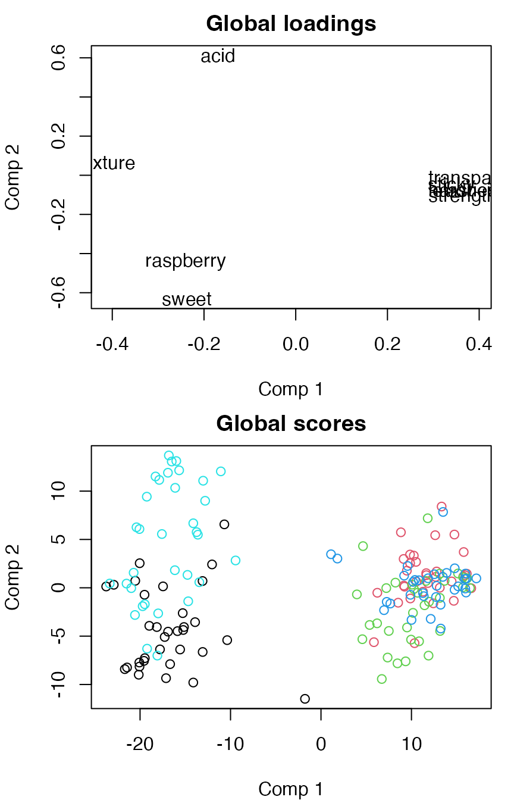

``` r

par(par.old)
```

### MSCA

Multilevel Simultaneous Component Analysis (MSCA) is a version of ASCA
that assumes a single factor to be used as a between-individuals factor,
while the the within-individuals is assumed implicitly.

``` r

# Default MSCA model with a single factor
mod.msca <- msca(assessment ~ candy, data=candies)
summary(mod.msca)
#> Multilevel Simultaneous Component Analysis fitted using 'lm' (Linear Model) 
#> - SS type II, sum coding, restricted model, least squares estimation, SSQ method: qr_regression 
#>          Sum.Sq. Expl.var.(%)
#> Between 33416.66        74.48
#> Within  11450.62        25.52
```

Scoreplots can be created for the between-individuals factor and the
within-individuals factor, and for each level of the within-individuals
factor.

``` r

# Scoreplot for between-individuals factor
scoreplot(mod.msca)
```

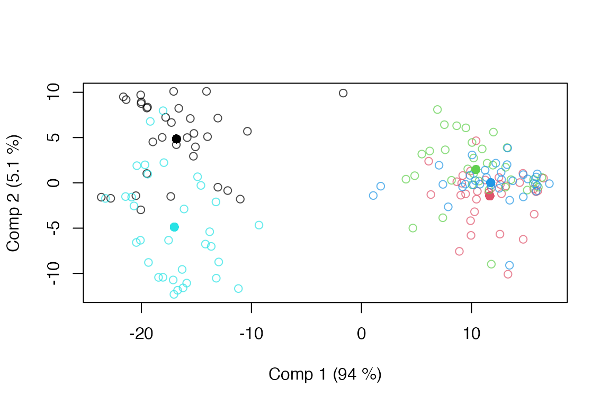

``` r


# Scoreplot of within-individuals factor
scoreplot(mod.msca, factor="within")
```

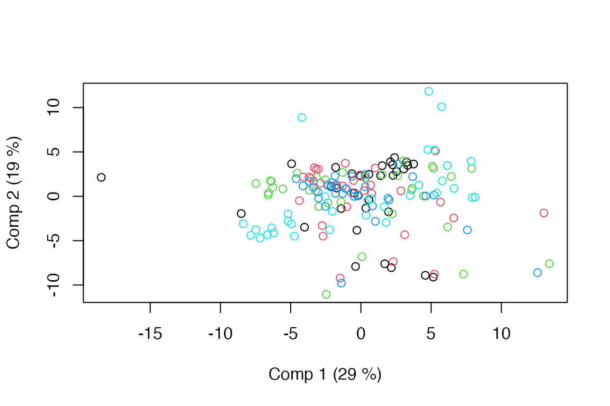

``` r


# .. per factor level
par.old <- par(mfrow=c(3,2), mar=c(4,4,2,1), mgp=c(2,0.7,0))
for(i in 1:length(mod.msca$scores.within))
 scoreplot(mod.msca, factor="within", within_level=i, 
           main=paste0("Level: ", names(mod.msca$scores.within)[i]),
           panel.first=abline(v=0,h=0,col="gray",lty=2))
par(par.old)
```

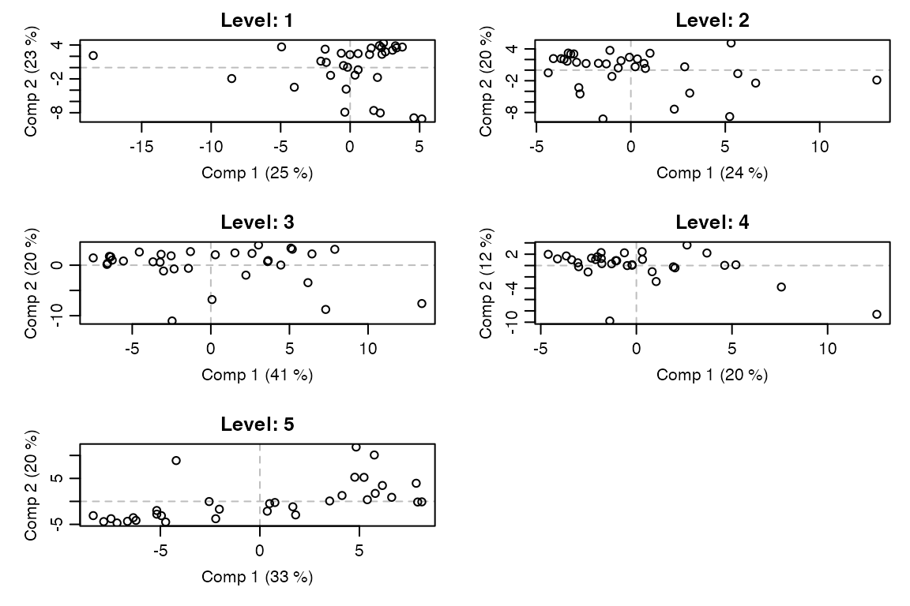

### LiMM-PCA

A version of LiMM-PCA is also implemented in HDANOVA. It combines
REML-estimated mixed models with PCA and scales the back-projected
errors according to degrees of freedom or effective dimensions (user
choice).

``` r

# Default LiMM-PCA model with two factors and interaction, 8 PCA components
mod.reml <- limmpca(assessment ~ candy*r(assessor), data=candies, pca.in=8)
#> boundary (singular) fit: see help('isSingular')
#> boundary (singular) fit: see help('isSingular')
summary(mod.reml)
#> LiMM-PCA fitted using 'lmm' (Linear Mixed Model) 
#> - SS type III, sum coding, restricted model, REML estimation, SSQ method: exact_refit 
#>                 Sum.Sq. Expl.var.(%)
#> candy          33415.98        74.73
#> candy:assessor   697.41         1.56
#> assessor         874.25         1.96
#> Residuals       7619.78        17.04
scoreplot(mod.reml, factor="candy")
```


One can also use least squares estimation without REML. This affects the
random effects and scaling of backprojections.

``` r

# LiMM-PCA with least squares estimation and 8 PCA components
mod.ls <- limmpca(assessment ~ candy*r(assessor), data=candies, REML=NULL, pca.in=8)
summary(mod.ls)
#> LiMM-PCA fitted using 'lmm' (Linear Mixed Model) 
#> - SS type III, sum coding, restricted model, least squares estimation, SSQ method: qr_regression 
#>                 Sum.Sq. Expl.var.(%)
#> candy          33415.98        74.73
#> assessor        1948.75         4.36
#> candy:assessor  3419.04         7.65
#> Residuals       5934.46        13.27
scoreplot(mod.ls)
```

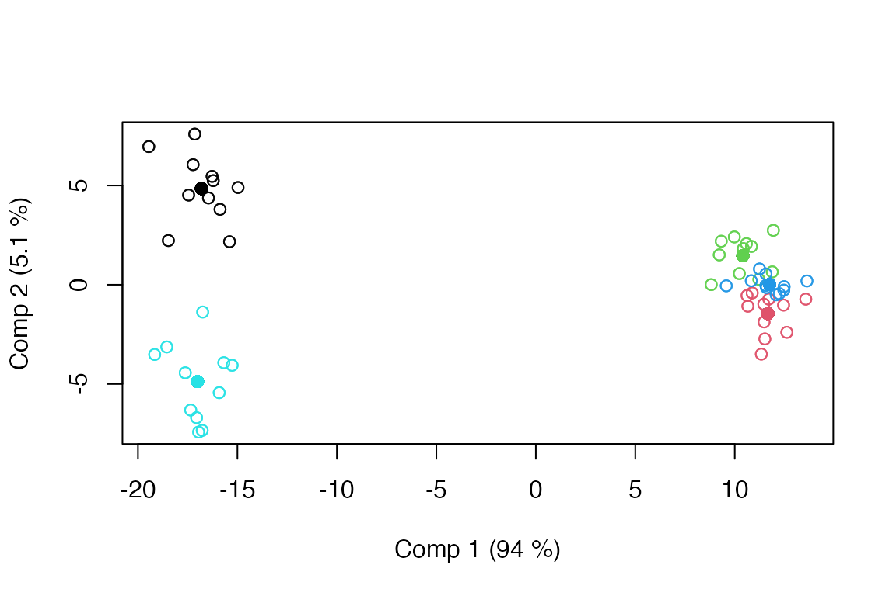

### Repeated measures

We revisit the simulated data from the ANOVA vignette to demonstrate
ASCA with repeated measures. The data are subset, a time effect is
added, and the response is extended to the multivariate case.

``` r

set.seed(123)
# Original simulation
dat <- data.frame(
  feed  = factor(rep(rep(c("low","high"), each=6), 4)),
  breed = factor(rep(c("NRF","Hereford","Angus"), 16)),
  bull  = factor(rep(LETTERS[1:4], each = 12)),
  daughter = factor(c(rep(letters[1:4], 3), rep(letters[5:8], 3), rep(letters[9:12], 3), rep(letters[13:16], 3))),
  age   = round(rnorm(48, mean = 36, sd = 5))
)
dat$yield <- 150*with(dat, 10 + 3 * as.numeric(feed) + as.numeric(breed) + 
                        2 * as.numeric(bull) + 1 * as.numeric(sample(dat$daughter, 48)) + 
                        0.5 * age + rnorm(48, sd = 2))
# Extended to repeated measures
long <- dat[c(1:4,9:12), c("feed", "daughter", "yield")]
long <- rbind(long, long, long)
long$daughter <- factor(long$daughter) # Remove redundant daughters
long$time  <- factor(rep(1:3, each=8))
long$yield <- long$yield + rnorm(24, sd = 100) + rep(c(-200,0,200), each=8)
# Made multiresponse (no added structure, only noise)
long$yield <- I(matrix(rep(long$yield,10),nrow=length(long$yield),ncol=10)) + rnorm(length(long$yield)*10)
```

Analysing the data with ASCA using the least squares approach.

``` r

# Least squares mixed model ASCA
mod.rm.asca <- asca(yield ~ r(daughter) + feed*r(time), data = long)
summary(mod.rm.asca)
#> Anova Simultaneous Component Analysis fitted using 'lmm' (Linear Mixed Model) 
#> - SS type II, sum coding, restricted model, least squares estimation, SSQ method: qr_regression 
#>                Sum.Sq. Expl.var.(%)
#> daughter   31997318.91        23.01
#> feed         306570.25         0.22
#> time        4309830.00         3.10
#> feed:time     57834.68         0.04
#> Residuals 102393907.07        73.63
```

Corresponding analysis using the LiMM-PCA approach with REML estimation.

``` r

# REML mixed model LiMM-PCA
mod.rm.limmpca <- limmpca(yield ~ r(daughter) + feed*r(time), data = long, pca.in=10)
#> boundary (singular) fit: see help('isSingular')
#> boundary (singular) fit: see help('isSingular')
#> boundary (singular) fit: see help('isSingular')
#> boundary (singular) fit: see help('isSingular')
#> boundary (singular) fit: see help('isSingular')
#> boundary (singular) fit: see help('isSingular')
#> boundary (singular) fit: see help('isSingular')
#> boundary (singular) fit: see help('isSingular')
#> boundary (singular) fit: see help('isSingular')
#> boundary (singular) fit: see help('isSingular')
#> Warning in pracma::Rank(object$LS[[object$more$effs[i]]]): Rank calculation may
#> be problematic.
summary(mod.rm.limmpca)
#> LiMM-PCA fitted using 'lmm' (Linear Mixed Model) 
#> - SS type III, sum coding, restricted model, REML estimation, SSQ method: exact_refit 
#>                Sum.Sq. Expl.var.(%)
#> feed         306570.25         0.22
#> feed:time         0.86         0.00
#> daughter    7163945.08         5.15
#> time              0.15         0.00
#> Residuals 115642343.08        83.16
```
