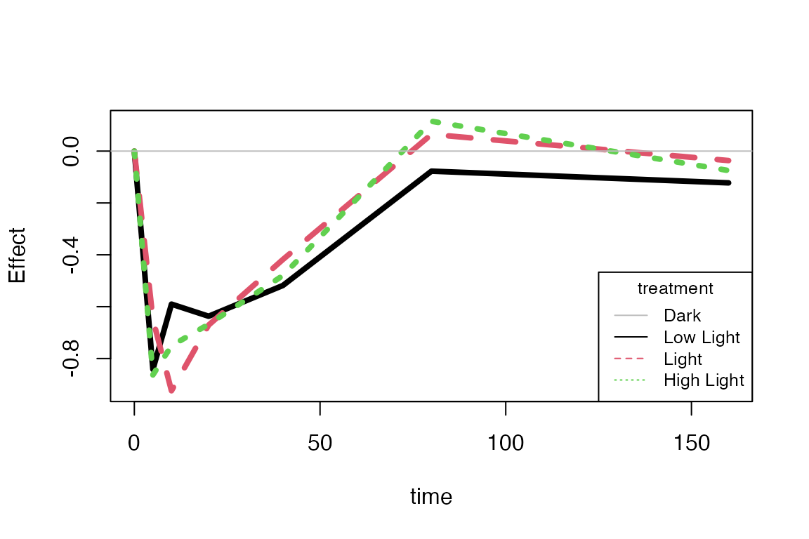

# D. Additional methods

``` r

# Start the HDANOVA R package
library(HDANOVA)
#> 
#> Attaching package: 'HDANOVA'
#> The following object is masked from 'package:stats':
#> 
#>     loadings
```

## Additional methods of HD-ANOVA

The examples shown here are HD-ANOVA methods that share aspects with
ASCA.

- Principal Response Curves (PRC)
- Permutation Based MANOVA (PERMANOVA)

### Principal Response Curves (PRC)

The PRC implementation we have wrapped is from the vegan package. A
single treatment factor and a time factor are accepted together with a
response matrix. The first level of the treatment factor is used as a
reference level, effectively set to zero. As the vegan package is aimed
at community ecology, the responses are called species. In our case, the
responses are compounds from the Caldana data.

``` r

# Load Caldana data
data(caldana)

prc.cal <- prc(compounds ~ light * time, caldana)
summary(prc.cal)
#> 
#> Call:
#> prc(formula = compounds ~ light * time, data = caldana) 
#> Species scores:
#>                    Alanine                     Valine 
#>                  -0.900828                  -0.175768 
#>                    Leucine                 Isoleucine 
#>                   0.657559                   0.264687 
#>                    Proline                     Serine 
#>                  -1.141926                   0.051640 
#>                  Threonine               beta-alanine 
#>                  -0.075174                   0.726471 
#>             Hydroxyproline                       GABA 
#>                   0.007045                   1.087892 
#>                  Aspartate                 Asparagine 
#>                   0.696076                   0.338664 
#>                 Methionine            O-acetyl-serine 
#>                  -0.863337                  -0.205739 
#>                  Glutamate              Phenylalanine 
#>                   0.337782                  -1.245032 
#>                  Ornithine                  Glutamine 
#>                  -0.041141                  -1.302687 
#>                     Lysine                   Tyrosine 
#>                   1.175389                   0.606966 
#>              Threonic-acid        Citrulline-Arginine 
#>                   0.323093                  -0.526770 
#>               Pyruvic-acid                Citric-acid 
#>                  -0.473488                   0.414141 
#>              Succinic-acid               Fumaric-acid 
#>                   0.690860                  -0.005060 
#>                 Malic-acid                Lactic-acid 
#>                  -0.006521                   0.497413 
#>              Glycolic-acid               Benzoic-acid 
#>                  -1.624649                   0.141741 
#>                Maleic-acid             Nicotinic-acid 
#>                  -0.767982                   0.060987 
#>              Itaconic-acid                Citramalate 
#>                   0.169012                  -0.050705 
#>     4-hydroxy-benzoic-acid Dehydroascorbic-acid-dimer 
#>                   0.191369                  -0.062572 
#>              Gluconic-acid       Dehydroascorbic-acid 
#>                   0.159411                   0.108530 
#>              Ascorbic-acid     4-Hydroxycinnamic-acid 
#>                   0.232603                   0.133527 
#>         Similar-to-Adenine                  Shikimate 
#>                  -0.010357                  -0.878436 
#>                 Erythritol                  Arabinose 
#>                   0.068112                   0.110114 
#>                   Arabitol                     Fucose 
#>                   0.337455                   0.051972 
#>                   Fructose                   Mannitol 
#>                  -3.606930                  -0.215745 
#>                  Galactose                    Glucose 
#>                  -0.097331                  -2.777645 
#>                    Sucrose                    Maltose 
#>                  -0.615215                   0.263945 
#>                  Trehalose                 Galactinol 
#>                   0.195746                  -0.211351 
#>               myo-inositol                     Uracil 
#>                   0.070161                   1.067653 
#>                 Putrescine               Ethanolamine 
#>                   0.210320                   0.546516 
#>                   Glycerol      Indole-3-acetonitrile 
#>                   0.146868                  -0.185760 
#>               Sinapic-acid              Palmitic-acid 
#>                  -0.131682                   0.267378 
#>          Octadecanoic-acid            Docosanoic-acid 
#>                   0.361142                   0.299480 
#>         Tetracosanoic-acid          Hexacosanoic-acid 
#>                  -0.060571                  -0.188997 
#>          Octacosanoic-acid 
#>                  -0.167153 
#> 
#> Coefficients for treatment + time:treatment interaction
#> which are contrasts to treatment Dark 
#> rows are treatment, columns are time
#>                     0        5       10        20        40      80     160
#> Low Light   2.465e-16 0.003685  0.05458  0.121789  0.006526 -0.1098 -0.1833
#> Light      -3.826e-17 0.038250 -0.10345  0.084547 -0.098440 -0.2416 -0.3368
#> High Light  2.047e-16 0.010944  0.01016 -0.009301 -0.312173 -0.6746 -0.7716
```

The default plot for PRC is a plot of treatment + time:treatment. As we
can see in the plot, the “Dark” level is the reference level from which
the other levels are contrasted.

``` r

plot(prc.cal, species = FALSE, axis = 2, lwd = 4, legpos = "bottomright")
```



### Permutation Based MANOVA (PERMANOVA)

The PERMANOVA implementation we have wrapped is from the vegan package.
Our wrapper takes care of the specialised formatting needed for the
inputs. By default, 999 permutations are performed for the factors, and
a standard Multivariate ANOVA is returned with permutation-based
p-values.

``` r

permanova.cal <- permanova(compounds ~ light * time, caldana)
permanova.cal
#> Permutation test for adonis under reduced model
#> Permutation: free
#> Number of permutations: 999
#> 
#> vegan::adonis2(formula = formula, data = data)
#>           Df SumOfSqs      R2      F Pr(>F)    
#> Model     27  0.79189 0.35355 2.2687  0.001 ***
#> Residual 112  1.44793 0.64645                  
#> Total    139  2.23982 1.00000                  
#> ---
#> Signif. codes:  0 '***' 0.001 '**' 0.01 '*' 0.05 '.' 0.1 ' ' 1
```
